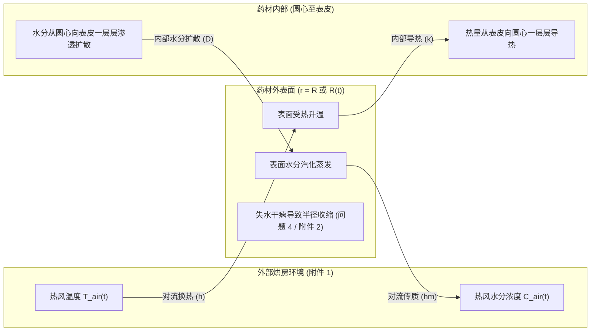
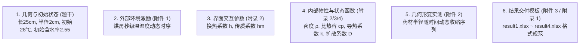
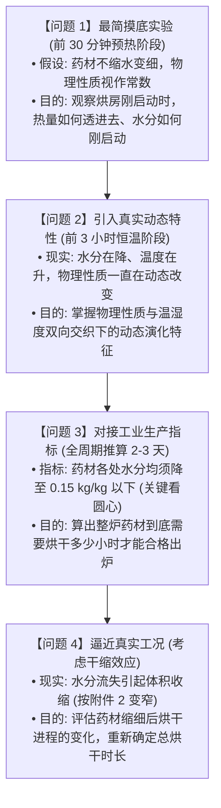

# A 题：药材的烘干问题 深度解析与资料梳理笔记

> [!NOTE]
> 本笔记旨在建立对 2026 年高教社杯全国大学生数学建模竞赛 **A 题（药材的烘干问题）** 的物理实质、已知资料定位与出题人递进逻辑的全面认知，暂不涉及具体数值算法实现。
> 知识库关联：[[A题.pdf]]

---

## 一、 物理全景：烘房中到底在发生什么？

这道题的物理本质是一根刚采摘的高水分圆柱形湿药材，置于热风烘房中，**热量由外向内渗透、水分由内向外迁移**的非定常动力学耦合过程。

整个物理过程由两条相互交织的链条驱动：

1. **热量传递链（由外向内，加热过程）**：
   * 烘房产生的热风掠过药材外表面，通过**对流换热**将热量传递给外表皮；
   * 表皮温度迅速升高，依靠药材自身的**导热能力**，热量从外层向最内部的圆心一层层传导；
   * 宏观表现：**外层温度高、升温快；内层温度低、升温滞后**。
2. **水分迁移链（由内向外，排湿过程）**：
   * 表皮受热后，外表面的自由水分汽化蒸发，被流动的干热风带走；
   * 外表面水分迅速减少，导致药材形成“外干、内湿”的水分差（浓度梯度）；
   * 内部深处的水分在浓度差及温度热运动的驱动下，沿着药材微观孔隙向外表面渗透扩散；
   * 宏观表现：**外层含水率迅速下降；最里面的圆心水分流失最慢、最后达标**。

---

## 二、 赛题资料全景盘点：它们是什么？有什么用？

出题人在题干、附件与附录中给出的每一项数据与公式，都有明确的物理现实对应与建模功能：

### 1. 几何尺寸与初始条件（题干）
* **长 $25\text{ cm}$，半径 $2\text{ cm}$**：
  * **是什么**：药材的几何尺寸。长径比为 $25 / 4 = 6.25 \gg 1$。
  * **有什么用**：在物理上，一根细长圆柱体的两端截面积非常小，热量和水分绝大部分是通过四周圆柱侧表面与外界热风交换的。因此可将复杂的三维空间问题，合理简化为**仅沿半径方向 $r \in [0, R]$ 的一维轴对称问题**。
* **初始温度 $28^\circ\text{C}$，水分浓度 $2.55\text{ kg/kg}$**：
  * **是什么**：烘干起点的物理状态。干基含水率 $2.55$ 意味着每 $1\text{ kg}$ 干物质含有 $2.55\text{ kg}$ 水分（初始含水率高达 $70\%+$）。
  * **有什么用**：为系统设定了 $t=0$ 时的全域初始场。

### 2. 附件 1：烘干初期烘房温湿度数据
* **是什么**：实验或工业现场采集的烘房内部热风环境时序曲线（包括秒级时间点对应的烘房温度与水分浓度）。
* **有什么用**：这是药材与外界交换能量和水分的**外部驱动源（边界条件输入）**。外界热风有多热、空气带走水蒸气的能力有多强，全由此数据驱动。

### 3. 附录 2：问题 1 的物性参数（预热阶段）
* **密度 $\rho = 820\text{ kg/m}^3$**：药材的表观质量密度。
* **比热容 $c_p = 2600\text{ J/(kg}\cdot\text{K)}$**：药材升温所需吸收的热量规模。
* **热传导系数 $k = 0.36\text{ W/(m}\cdot\text{K)}$**：决定热量从表皮向圆心传导的快慢。
* **对流换热系数 $h = 25\text{ W/(m}^2\cdot\text{K)}$**：热风把热量传递给外表面的速率。
* **对流传质系数 $h_m = 8 \times 10^{-7}\text{ m/s}$**：流动空气把外表面蒸发出来的水分带走的速率。
* **扩散系数公式 $D = 7 \times 10^{-9} \exp(-0.89/C)$**：
  * **物理内涵**：水分子在药材内部向外渗透的能力。
  * **变化规律**：含水率 $C$ 越高，扩散较快；随着药材变干（$C$ 下降），水分被紧紧吸附在微孔孔壁，扩散阻力剧增（呈指数衰减）。

### 4. 附录 3：问题 2 与 3 的经验公式（全过程 / 恒温阶段）
* **为什么附录 2 不够用，要引入附录 3？**
  * 预热阶段仅持续 30 分钟，药材含水率变化不大，物性可视为常量；
  * 恒温阶段需持续 2~3 天，含水率从 $2.55$ 剧降至 $0.15$ 以下，药材微观结构发生剧变：
    * $\rho(C) = 650 + 128C$：水分流失，整体质量减轻；
    * $c_p(C), k(C)$：水是高比热、高导热介质，失水后药材储热和导热能力同步下降；
    * $D(C, T) = 2.4 \times 10^{-3} \exp(-0.45/C) \exp(-3850/T)$：水分扩散不仅取决于含水率，还强烈取决于**当时局部的绝对温度 $T$**（符合阿伦尼乌斯热激活规律：温度越高，分子热运动越剧烈，扩散越快）。

### 5. 附件 2 与 附录 4：问题 4 的变形与修正参数
* **附件 2（药材半径随时序变化的实测值）**：
  * **是什么**：记录药材随失水不断变细、干瘪的实测外轮廓尺寸数据。
  * **有什么用**：明确外表面不再是一堵固定的墙，而是一堵逐渐向内缩回的“移动边界”。
* **附录 4 的修正公式**：
  * **为什么物性公式再次调整？**：药材收缩后，内部微观纤维与孔隙受挤压变密实，其密度、比热容、导热率及扩散阻力与未收缩状态存在差异，此公式提供了收缩状态下的专用参数。

---

## 三、 出题人的设计脉络：四道题到底在层层探究什么？

出题人引导我们完成的是一个从“最简理想化”逐步迈向“工业工程真实”的探究全过程：

1. **问题 1（基准起步）**：剥离变物性与变形，验证基础框架对升温起步和初始失水的刻画能力。
2. **问题 2（参数动态化）**：纳入状态反作用于物性的真实机制，考察 3 小时内的温度与含水率演化。
3. **问题 3（工艺终点判定）**：将仿真推进至 2~3 天的完整周期，推算最里层（圆心）含水率降到 $0.15$ 的精确停机时间。
4. **问题 4（几何动态化）**：将边界收缩纳入考量，解决“药材变细后路程变短、但组织变密，最终烘干到底变快还是变慢”的现实工业问题。

---

## 四、 当前阶段必须建立的核心认知与常识判断

在建立具体模型或编写程序之前，脑海中应具备以下关键认知：

1. **中心轴对称性**：
   * 圆柱对称使得中心轴两侧物理状态完全镜像对称，因此中心处的温度与水分空间导数（梯度）恒等于 0。
2. **最表层是驱动也是瓶颈**：
   * 烘房的所有热量和排湿吸力都必须先通过外表面；外表面最先升温、失水最快。
3. **最内部的圆心是决定烘干时长的核心判据**：
   * 问题 3 和 4 要求“各处水分均低于 $0.15$”，由于水分由内向外扩散，外表早就达标，**全域达标的本质就是中心轴（$r=0$）达标**。
4. **量纲与单位陷阱**：
   * 附件 1 与 2 中时间是秒（s）或小时（h），几何尺寸是厘米（cm）或米（m）。
   * 经验公式中扩散系数的温度 $T$ 必须采用**开尔文绝对温度（$\text{K} = ^\circ\text{C} + 273.15$）**，若误用摄氏度将导致指数项严重失真。

---

## Sources
- [[A题.pdf]]
