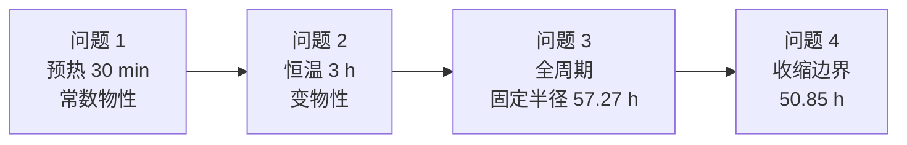
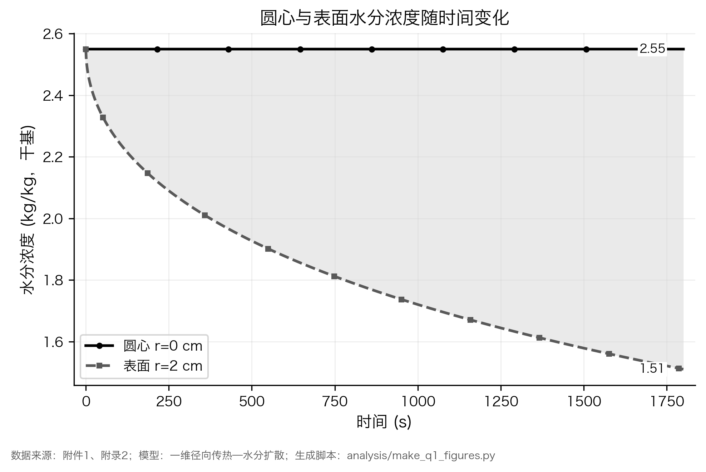
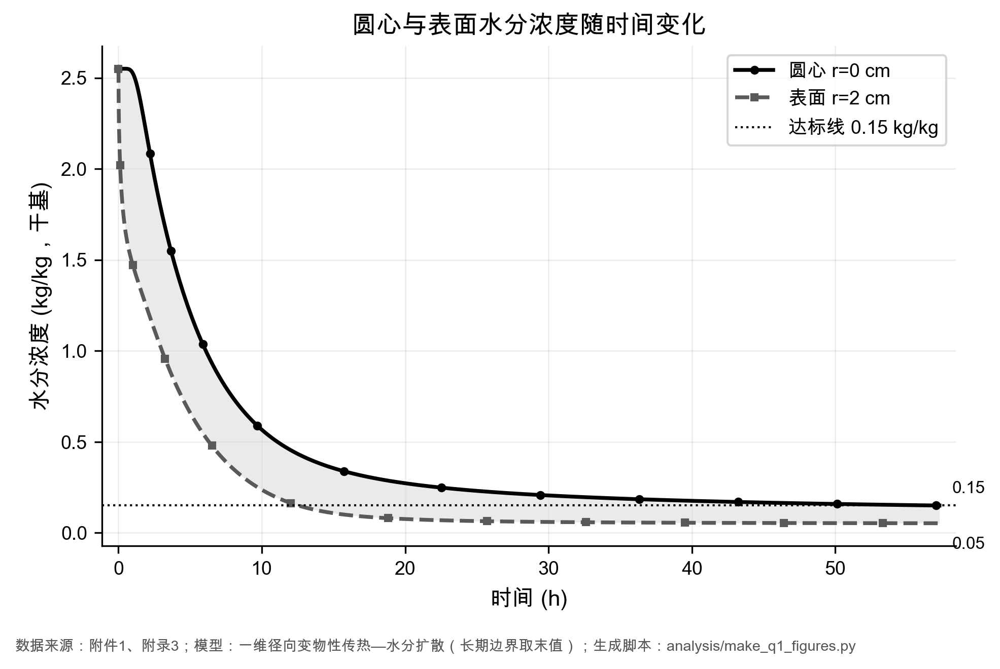
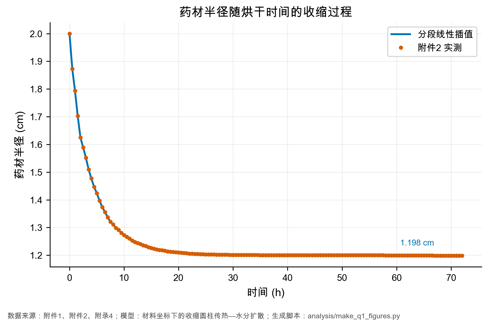
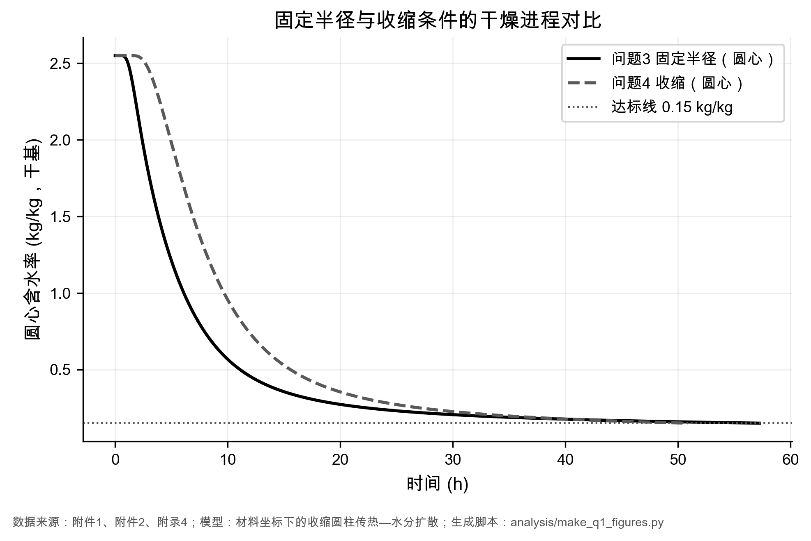

<p align="center">
  
</p>

<p align="center">
  <a href="https://github.com/ciyuan1234/MCM_2026/stargazers"></a>
  
  
  
  
</p>

<p align="center">
  <b>中文</b> · <a href="README_EN.md">English</a> · <a href="docs/paper_draft.md">论文草稿</a> · <a href="docs/overview.md">四问总览</a> · <a href="docs/README.md">文档索引</a>
</p>

# 药材烘干：可复现的传热—传质求解仓库

2026 年高教社杯全国大学生数学建模竞赛 **A 题** 的完整开源实现。一根刚采摘的圆柱形湿药材，在热风烘房中经历「热量由外向内、水分由内向外」的耦合过程。本仓库用 **一维径向守恒模型 + 隐式有限体积**，把四问从最简常数物性一路做到变物性、全周期终点和收缩边界，并且 **每一个头条数字都能追溯到代码、测试和结果文件**。

> 如果这份实现帮你读懂 A 题、复现结果或写论文，欢迎点右上角 **Star**。这是对开源工作最好的支持。

## 30 秒看懂结论

| 问题 | 模型 | 时间范围 | 核心答案 |
| --- | --- | --- | --- |
| 1 | 附录 2 常数物性 | 0–30 min | 表面先升温、先失水；1800 s 时圆心仍为 **2.5500 kg/kg**，几乎未动 |
| 2 | 附录 3 变物性 | 0–3 h | 传热已完成（径向温差 **0.117 °C**），圆心含水率 **1.7662 kg/kg**，远未达标 |
| 3 | 变物性 + 长期边界 | 全周期 | 圆心 \(C\le 0.15\) 的烘干时间 **\(t_f = 57.2667\) h** |
| 4 | 材料坐标收缩圆柱 | 全周期 | 半径 \(2.000\to 1.198\) cm 后 **\(t_f = 50.8500\) h**，净缩短 **11.2%** |

问题 4 真正回答的是题目最关心的一句：**药材变细后，烘干到底更快还是更慢？** 路径缩短会加速，组织变密会减速。效应分解后：物性 **+71.9 h**、几何 **−78.3 h**，两个大效应几乎抵消，净收益只有 11.2%。



## 为什么值得 Star

- **四问闭环，不是半成品脚本**：从预热摸底到工业终点，再到收缩效应分解，每问都有模型说明、决策日志、论文素材和交付模板。
- **数字可追溯**：头条结果锁在 `outputs/result{1..4}.xlsx` 与 `tests/test_q*_conclusion.py`；网格、时间步、代码哈希写在 `outputs/run_manifest_q*.json`。
- **验证不是口头承诺**：守恒残差到 \(10^{-13}\) 量级；问题 3 / 4 有网格与时间步收敛；独立实现复算（显式差分、BDF）写在 `docs/experiments/`。
- **论文级图件已生成**：22 张黑白灰阶图 × PNG/PDF/SVG，坐标、单位、来源、生成脚本齐全，可直接进正文或附录。
- **工程化仓库**：`src/` 求解内核与 `analysis/solve.py` 入口分离，SI 单位贯穿计算层，`pytest` 默认 60 项（长时程收敛标了 `slow`）。

## 结果速览

<p align="center">
  
  
</p>
<p align="center">
  
  
</p>

完整图目录见 [`docs/paper_figures.md`](docs/paper_figures.md)，四问对照与不确定度见 [`docs/overview.md`](docs/overview.md)。

## 快速开始

需要 **Python 3.11+**。问题 1、2 的 Excel 导出若要走 Node 工作簿构建器，可加 `--no-build-xlsx`，仓库里已经带好填好的 `outputs/result*.xlsx`。

```bash
git clone https://github.com/ciyuan1234/MCM_2026.git
cd MCM_2026

python3 -m venv .venv
source .venv/bin/activate          # Windows: .venv\Scripts\activate
pip install -r requirements.txt

python -m pytest -q                # 默认跳过 slow 收敛复算
```

复现四问（问题 3、4 是长时程，需要较细网格，耗时会明显增加）：

```bash
python analysis/solve.py --problem 1
python analysis/solve.py --problem 2
python analysis/solve.py --problem 3
python analysis/solve.py --problem 4
```

重新出图：

```bash
python analysis/make_q1_figures.py --problem 1
python analysis/make_q1_figures.py --problem 4
```

细网格完整场 `outputs/*_solution.json` 单文件可超过 100 MB，未入库；可用上面的求解命令按 `run_manifest` 记录的参数重生。

## 仓库结构

```text
MCM_2026/
├── A题.pdf                          # 赛题原文（需求与公式的最终依据）
├── 附件/                            # 只读输入：烘房时序、半径收缩、结果模板
├── src/                             # 计算内核（配置、物性、插值、径向求解器、导出）
├── analysis/                        # 复现入口、出图、收敛、交付自检
├── tests/                           # pytest：初值 / 极限 / 守恒 / 回归 / 结论追溯
├── outputs/                         # 结果工作簿、运行清单、收敛证据、论文图
│   └── figures/                     # 22 × {png, pdf, svg}
└── docs/                            # 总览、模型、决策日志、论文草稿、实验任务卡
```

| 路径 | 作用 |
| --- | --- |
| [`src/radial_solver.py`](src/radial_solver.py) | 隐式有限体积：固定半径与材料坐标收缩 |
| [`src/material.py`](src/material.py) | 附录 2 / 3 / 4 物性 |
| [`analysis/solve.py`](analysis/solve.py) | 唯一复现入口 |
| [`docs/paper_draft.md`](docs/paper_draft.md) | 论文 Markdown 主稿 |
| [`AGENTS.md`](AGENTS.md) | 协作与证据章程（给人和 AI 代理） |

## 模型要点

- **几何**：长径比 \(25/4 = 6.25 \gg 1\)，简化为沿半径的一维轴对称问题；\(r=0\) 单独处理对称边界，禁止把 \(1/r\) 通式直接代入圆心。
- **驱动**：附件 1 烘房温湿度分段线性插值；问题 3、4 在 \(t>14400\) s 后保持末值（不确定度已量化为 **+0.36 h**）。
- **问题 4**：半径按附件 2 收缩，坐标 \(\xi = r/R(t)\)，避免移动网格对流项。
- **单位**：内核统一 SI（m, s, K, kg）；阿伦尼乌斯项的 \(T\) 必须用开尔文。
- **未引入**：蒸发潜热与焓输运（题目未给参数，见局限）。

## 验证与局限

本地完整测试（含结论追溯）共 **60 项通过**。没有细网格 `*_solution.json` 时，可只跑快测子集（见 [`CONTRIBUTING.md`](CONTRIBUTING.md)）。

| 检查 | 问题 1 | 问题 2 | 问题 3 | 问题 4 |
| --- | ---: | ---: | ---: | ---: |
| 水分守恒相对误差 | \(7.2\times 10^{-15}\) | \(2.8\times 10^{-15}\) | \(1.5\times 10^{-14}\) | \(5.3\times 10^{-15}\) |
| 网格 / 时间步对 \(t_f\) | — | — | 0.054 h / 0.013 h | 0.006 h / 0.010 h |

已知局限（详情在 [`docs/overview.md`](docs/overview.md) 第 7 节）：

- \(t>14400\) s 烘房状态未观测，末值保持带来 **+0.36 h**；
- 未计潜热，干燥速率可能被系统性高估；
- 问题 4 采用仿射收缩，真实内部变形不可识别；
- 附录 4 物性与附件 2 收缩度不完全自洽（干密度差约 13.5%）；
- 无药材内部实测，不能声称经验精度，只有守恒、自收敛和独立复算。

## 文档地图

| 想看什么 | 去哪里 |
| --- | --- |
| 四问数字、假设对照、证据索引 | [`docs/overview.md`](docs/overview.md) |
| 论文正文草稿 | [`docs/paper_draft.md`](docs/paper_draft.md) |
| 物理图像与出题逻辑 | [`A题_药材烘干问题深度解析笔记.md`](A题_药材烘干问题深度解析笔记.md) |
| 各问模型 / 决策 / 写作素材 | [`docs/problem_1_model.md`](docs/problem_1_model.md) 起 |
| 数据字典与处理规则 | [`docs/data_dictionary.md`](docs/data_dictionary.md) |
| 实验任务卡 | [`docs/experiments/`](docs/experiments/) |
| 完整目录 | [`docs/README.md`](docs/README.md) |

## 相关项目

同一作者的国赛 AI 工作流：[ciyuan1234/MCM_skills](https://github.com/ciyuan1234/MCM_skills) — 读题、建模、写作、格式检查到打包的 72 小时 skill 包。

## 引用

如果你在论文、博客或二次开发中用到本仓库，请引用：

```bibtex
@software{mcm2026_herb_drying,
  title  = {CUMCM 2026 Problem A: Herb Drying},
  author = {ciyuan1234},
  year   = {2026},
  url    = {https://github.com/ciyuan1234/MCM_2026}
}
```

也可用 GitHub 自动生成的 [`CITATION.cff`](CITATION.cff)。

## 许可

代码与文档以 [MIT License](LICENSE) 发布。赛题 PDF 与官方附件的版权归竞赛组委会，本仓库仅供学习与复现。

---

<p align="center">
  如果它帮到了你，请给仓库一个 Star，让更多数模同学能搜到这份可复现实现。
</p>
