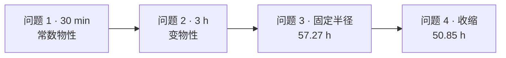

<p align="center">
  
</p>

<p align="center">
  
  
  
  
  
</p>

<p align="center">
  <a href="README_EN.md">English</a>
  ·
  <a href="docs/overview.md">四问总览</a>
  ·
  <a href="docs/paper_draft.md">论文草稿</a>
  ·
  <a href="docs/README.md">全部文档</a>
</p>

# 2026 国赛 A 题 · 药材烘干

2026 年高教社杯全国大学生数学建模竞赛 **A 题** 开源仓库：赛题、代码、结果表、论文图和复现说明都在这里。

一根刚采摘的圆柱形湿药材在热风烘房里烘干。热量由表及里，水分由里及表。本仓库用 **一维径向传热—水分扩散 + 隐式有限体积**，把四问从最简常数物性做到变物性、全周期终点和收缩边界。结论里的每一个数字都能追到代码、测试和 `outputs/` 里的文件。

如果对你写论文或复现有帮助，欢迎点右上角 **Star**。

## 本仓库有什么

| 内容 | 位置 |
| --- | --- |
| 赛题原文 | [`A题.pdf`](A题.pdf) |
| 官方附件（只读） | [`附件/`](附件/) |
| 求解代码 | [`src/`](src/) · [`analysis/solve.py`](analysis/solve.py) |
| 四问结果表 | [`outputs/result1.xlsx`](outputs/result1.xlsx) ~ [`result4.xlsx`](outputs/result4.xlsx) |
| 论文图（PNG / PDF / SVG） | [`outputs/figures/`](outputs/figures/) |
| 论文 Markdown 草稿 | [`docs/paper_draft.md`](docs/paper_draft.md) |
| 四问数字与证据对照 | [`docs/overview.md`](docs/overview.md) |

## 四问结论

| 问题 | 做了什么 | 答案 |
| --- | --- | --- |
| 1 | 预热 30 min，常数物性 | 表面先升温、先失水；1800 s 时圆心含水率仍为 **2.5500 kg/kg** |
| 2 | 恒温 3 h，变物性 | 传热已完成（径向温差 **0.117 °C**），圆心仍 **1.7662 kg/kg**，远未达标 |
| 3 | 全周期，固定半径 | 圆心降到 0.15 kg/kg 需要 **57.2667 h** |
| 4 | 全周期，半径收缩 | 半径 2.000 → 1.198 cm 后变为 **50.8500 h**，净缩短 **11.2%** |

题目真正关心的是第 4 问：**药材变细后，烘干更快还是更慢？**  
路径变短会加速，组织变密会减速。拆开以后：物性 **+71.9 h**，几何 **−78.3 h**，两个大效应几乎抵消，净收益只有一成。



## 结果图

<p align="center">
  
  
</p>
<p align="center">
  
  
</p>

图注、编号和正文/附录划分见 [`docs/paper_figures.md`](docs/paper_figures.md)。

## 怎么跑

需要 Python 3.11+。仓库里已经带好填完的 `outputs/result*.xlsx`，只看结论的话不用重算。

```bash
git clone https://github.com/ciyuan1234/MCM_2026.git
cd MCM_2026

python3 -m venv .venv
source .venv/bin/activate          # Windows: .venv\Scripts\activate
pip install -r requirements.txt

python -m pytest -q                # 默认跳过耗时长的收敛复算
```

四问重新求解（问题 3、4 网格细、时间长，会比较慢）：

```bash
python analysis/solve.py --problem 1
python analysis/solve.py --problem 2
python analysis/solve.py --problem 3
python analysis/solve.py --problem 4
```

只出图：

```bash
python analysis/make_q1_figures.py --problem 1
python analysis/make_q1_figures.py --problem 4
```

导出 Excel 若缺 Node 工作簿构建器，加上 `--no-build-xlsx`。细网格场文件 `outputs/*_solution.json` 超过 100 MB，没有入库，可用上面的命令按 `run_manifest` 重生。

## 目录

```text
MCM_2026/
├── A题.pdf                 赛题
├── 附件/                   烘房时序、收缩数据、官方结果模板（只读）
├── src/                    计算内核（物性、插值、径向求解器）
├── analysis/solve.py       复现入口
├── tests/                  60 项 pytest
├── outputs/                结果表、运行清单、论文图
└── docs/                   总览、各问模型、论文草稿
```

## 想深入看

| 你想看 | 去这里 |
| --- | --- |
| 四问数字、假设、证据、局限 | [`docs/overview.md`](docs/overview.md) |
| 论文正文 | [`docs/paper_draft.md`](docs/paper_draft.md) |
| 物理图像和出题逻辑 | [`A题_药材烘干问题深度解析笔记.md`](A题_药材烘干问题深度解析笔记.md) |
| 第 n 问模型 / 决策 / 写作素材 | [`docs/problem_1_model.md`](docs/problem_1_model.md) 起 |
| 完整文档目录 | [`docs/README.md`](docs/README.md) |

同一作者的国赛 AI 工作流：[ciyuan1234/MCM_skills](https://github.com/ciyuan1234/MCM_skills)

## 引用

```bibtex
@software{mcm2026_herb_drying,
  title  = {CUMCM 2026 Problem A: Herb Drying},
  author = {ciyuan1234},
  year   = {2026},
  url    = {https://github.com/ciyuan1234/MCM_2026}
}
```

也可用仓库里的 [`CITATION.cff`](CITATION.cff)。

## 许可

代码与文档为 [MIT License](LICENSE)。赛题 PDF 和官方附件版权归竞赛组委会，本仓库仅供学习与复现。
