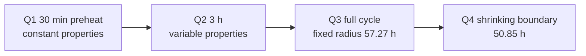

<p align="center">
  
</p>

<p align="center">
  <a href="https://github.com/ciyuan1234/MCM_2026/stargazers"></a>
  <a href="https://github.com/ciyuan1234/MCM_2026/actions/workflows/ci.yml"></a>
  
  
  
  
</p>

<p align="center">
  <a href="README.md">中文</a> · <b>English</b> · <a href="docs/paper_draft.md">Paper draft</a> · <a href="docs/overview.md">Overview</a>
</p>

# Herb drying: a reproducible heat–moisture solver

Open implementation of **CUMCM 2026 Problem A**. A freshly harvested cylindrical herb dries in a hot-air oven: heat moves inward, moisture moves outward. This repository solves all four subproblems with a **1-D radial conservation model** and an **implicit finite-volume scheme**, from constant properties through variable properties, a process endpoint, and a shrinking boundary. Every headline number traces back to code, tests, and result files.

> If this helped you understand the problem, reproduce the numbers, or write a paper, please **star** the repo.

## Results in 30 seconds

| Q | Model | Horizon | Answer |
| --- | --- | --- | --- |
| 1 | Appendix-2 constant properties | 0–30 min | Surface heats and dries first; at 1800 s the center is still **2.5500 kg/kg** |
| 2 | Appendix-3 variable properties | 0–3 h | Heat transfer is done (radial \(\Delta T = 0.117^\circ\mathrm{C}\)); center moisture **1.7662 kg/kg**, far from target |
| 3 | Variable properties + long-term boundary | full cycle | Time to \(C\le 0.15\) at the center: **\(t_f = 57.2667\) h** |
| 4 | Material-coordinate shrinking cylinder | full cycle | Radius \(2.000\to 1.198\) cm gives **\(t_f = 50.8500\) h**, **11.2% faster** |

Question 4 is the industrial question: **does shrinkage speed drying up or slow it down?** Shorter path accelerates; denser tissue decelerates. Decomposition: properties **+71.9 h**, geometry **−78.3 h**. The two large effects nearly cancel.



## Why star this

- Closed four-question pipeline, not a half-finished notebook.
- Headline numbers are pinned to `outputs/result{1..4}.xlsx` and `tests/test_q*_conclusion.py`.
- Mass-balance residuals at \(10^{-13}\); grid/step convergence for Q3/Q4; independent recodes in `docs/experiments/`.
- 22 grayscale paper figures × PNG/PDF/SVG, with units, sources, and generator scripts.
- SI units in the kernel, a single entry point `analysis/solve.py`, and 60 pytest cases.

## Quick start

Python 3.11+. Pre-filled workbooks already live in `outputs/`. Use `--no-build-xlsx` if you do not need the Node workbook builder.

```bash
git clone https://github.com/ciyuan1234/MCM_2026.git
cd MCM_2026
python3 -m venv .venv
source .venv/bin/activate
pip install -r requirements.txt
python -m pytest -q
```

```bash
python analysis/solve.py --problem 1   # likewise 2, 3, 4
python analysis/make_q1_figures.py --problem 1
```

Fine-grid `outputs/*_solution.json` files exceed 100 MB and are gitignored; regenerate them from the manifests.

## Layout

```text
src/          kernel (config, properties, interpolators, radial solver, export)
analysis/     solve / figures / convergence / delivery checks
tests/        pytest
outputs/      workbooks, run manifests, figures
docs/         overview, models, decision logs, paper draft, experiment briefs
附件/         read-only contest attachments
```

## Citation

```bibtex
@software{mcm2026_herb_drying,
  title  = {CUMCM 2026 Problem A: Herb Drying},
  author = {ciyuan1234},
  year   = {2026},
  url    = {https://github.com/ciyuan1234/MCM_2026}
}
```

See [`CITATION.cff`](CITATION.cff). Code is [MIT](LICENSE). The contest PDF and official attachments remain copyright of the organizing committee.
