# 药材烘干过程的一维径向传热—水分扩散建模与烘干时间确定

## 摘要

圆柱形湿药材在热风烘房中经历升温与失水两个耦合过程。本文依次回答四个递进的问题：预热阶段的温度与含水率分布、恒温阶段 3 h 内的全过程演化、使药材各处含水率降到 0.15 kg/kg 以下所需的烘干时间，以及考虑药材失水收缩后的烘干时间。

在数据预处理阶段，本文对附件 1（烘房温湿度）与附件 2（药材半径）做了完整性与一致性校验，未发现缺失、重复、时间倒序或局部异常，因此采取"只校验、不改值"的策略：不做插补、不平滑、不删除异常点，只进行单位转换、分段线性插值与输出舍入，并用敏感性实验量化了不同插值方式的影响。此后四问共用同一套一维轴对称传热—水分扩散模型：内部热量以 Fourier 导热传递，水分以 Fick 扩散迁移，表面为对流换热与对流传质边界，圆心为对称边界；数值上采用有限体积离散、隐式 Euler 时间推进与 Picard 迭代处理非线性。四问只在物性来源、时间跨度与几何处理上依次替换，使差异可以完全归因于被替换的物理量或几何量。为回答第四问，模型改用材料坐标 ξ = r/R(t)，把移动边界转化为固定计算域上的度量因子。

主要结果：问题一（预热 30 min，常数物性）1800 s 时圆心 33.5765 °C、含水率 2.5500 kg/kg，表面 36.7863 °C、1.5103 kg/kg，圆心含水率 30 min 内仅变化 7.89×10⁻⁶ kg/kg，说明预热阶段只完成表面升温和初始排湿；问题二（恒温 3 h，附录 3 变物性）3 h 时径向温差已降到 0.1170 °C，而含水率径向差仍有 0.7581 kg/kg，圆心含水率 1.7662 kg/kg，远未达标；问题三（全周期，固定半径）各处达标的烘干时间为 **57.2667 h**（线性内插 57.2506 h）；问题四（全周期，含收缩）半径由 2.000 cm 收缩到 1.198 cm，烘干时间降为 **50.8500 h**，比固定半径缩短 6.4167 h，约 11.2%。

机理与边界：传热远快于传质，烘干后期的瓶颈在药材内部扩散而非表面条件；干燥过程明显分三段，24 h 之后进入慢速尾部；收缩是"路程缩短"与"扩散能力下降"两种相反作用的竞争结果，前者占优但幅度远小于纯几何预期。主要不确定性为：长期边界处理 ±0.36 h，忽略收缩过程会低估 3.2820 h，题目给出的物性与收缩数据之间存在约 13.5% 的干物质不自洽。本文所有参数与公式均来自题目正文、附件与附录，未引入外部数据或文献值。

**关键词**：径向传热—水分扩散；有限体积法；变物性；移动边界；材料坐标；烘干时间

## 1. 问题重述与总体分析

### 1.1 问题背景与已知条件

药材可视为长 25 cm、半径 2 cm 的圆柱体，初始温度 28 °C，初始干基含水率 2.55 kg/kg。本文所称"水分浓度（干基）"即干基含水率，两种称法同义；为与题目用词一致，图件统一标注为"水分浓度（干基）"。烘干过程中，烘房热风通过对流换热把热量传到药材表面，热量再以导热方式向内传递；表面水分汽化后被气流带走，内部水分则在浓度梯度作用下向外扩散。四个问题要求在不同简化程度下刻画这一过程，并最终确定工业意义上的烘干时间。

题目提供的资料可分四类，它们决定了模型必须包含的机制：

| 资料       | 内容                            | 在模型中的作用                     |
| -------- | ----------------------------- | --------------------------- |
| 题目正文     | 几何尺寸、初始温度与初始含水率               | 计算域与初始场                     |
| 附件 1     | 烘房空气温度与含水率时序（241 点，0～14400 s） | 表面换热与传质的驱动条件                |
| 附件 2     | 药材半径时序（145 点，0～259200 s）      | 问题四的移动边界 R(t)               |
| 附录 2/3/4 | 三套物性与表面系数                     | 问题一（常数）、问题二/三（变物性）、问题四（收缩态） |
| 附件 3     | 结果模板（表头、行列与单位）                | 交付结果的格式约束                   |

### 1.2 四个问题的递进关系与总体思路

四个问题不是四个彼此独立的模型，而是同一物理过程的四个观察层次：

| 问题 | 观察层次         | 相对前一问的变化              |
| -- | ------------ | --------------------- |
| 一  | 预热阶段（30 min） | 基准框架：常数物性、固定半径        |
| 二  | 恒温阶段（3 h）    | 物性改为随含水率与温度变化         |
| 三  | 全周期（2～3 天）   | 时间跨度扩展，并引入"各处达标"的终止判据 |
| 四  | 全周期 + 几何变化   | 半径按实测收缩，物性改为收缩态经验式    |

据此，本文采取"先建立可验证的最小框架、再逐层加入题目要求的新机制"的总体思路，而不是为每一问重新选择模型。这样每一步只引入一个变化：问题二只换物性，问题三只换时间尺度与终止判据，问题四只换几何与物性来源。如果某一问的结果出现异常，就可以直接定位到被替换的那一项，而不必在两套完全不同的模型之间作比较。

### 1.3 模型简化的量级依据

在建立方程之前，先用几个无量纲量与渗透深度判断哪些简化是允许的。药材长 25 cm、半径 2 cm，长径比 L/R = 12.5，两端截面占总表面积比例很小，且热量与水分主要通过圆柱侧面交换，因此端部效应可作为高阶修正忽略，三维问题简化为一维轴对称问题。半径方向的热渗透深度约为 1.74 cm、水分渗透深度约为 0.30 cm，两者都远小于药材长度，进一步说明主要梯度确实发生在半径方向。

时间尺度方面，预热阶段的热扩散 Fourier 数 Fo ≈ 0.76，说明 30 min 内温度场远未达到稳态；传热 Biot 数 Bi = hR/k ≈ 1.39，说明内部导热与表面对流换热同样重要，药材不能被当作温度均匀的集总体。这两点排除了稳态模型与集总参数模型，也决定了后文必须求解带内部梯度的非稳态方程。

## 2. 数据预处理

### 2.1 数据来源与内容

| 数据         | 数据行数 | 时间范围与步长           | 数值范围                                         | 用途        |
| ---------- | ---: | ----------------- | -------------------------------------------- | --------- |
| 附件 1 温度    |  241 | 0～14400 s，60 s    | 28～50.246 °C（首末值 28 / 50.165 °C）             | 四问的表面换热驱动 |
| 附件 1 空气含水率 |  241 | 同上                | 0.01963～0.05025 kg/kg（首末值 0.01963 / 0.04986） | 四问的表面传质驱动 |
| 附件 2 半径    |  145 | 0～259200 s，1800 s | 2.000～1.198 cm                               | 问题四的移动边界  |

需要特别区分两个容易混淆的量：题目给出的初始干基含水率 2.55 kg/kg 是**药材内部**的水分浓度，而附件 1 中 t = 0 时的 0.01963 kg/kg 是**烘房空气**的水分浓度，两者量级与含义都不同，不能混用。药材内部水分浓度在模型中是待求的状态量，附件 1 的空气水分浓度只出现在表面的对流传质边界中。

### 2.2 数据校验

对两份附件做完整性与一致性检查，结果如下：

| 检查项   | 附件 1                                      | 附件 2                      |
| ----- | ----------------------------------------- | ------------------------- |
| 缺失值   | 无                                         | 无                         |
| 重复时间戳 | 无                                         | 无                         |
| 时间单调性 | 严格递增（60 s）                                | 严格递增（1800 s）              |
| 非有限值  | 无                                         | 无                         |
| 取值范围  | 温度 28～50.246 °C，含水率 0.01963～0.05025 kg/kg | 半径 2.000～1.198 cm，单调不增    |
| 局部异常  | 一阶差分的稳健离群检测未发现 \|z\| > 3.5 的点             | 同左；最大单步下降 0.127 cm，末端存在平台 |

这里需要说明一个判断上的取舍：对原始值直接做全局离群检测会受到长期趋势的干扰（升温与收缩本身就是趋势），因此本文改用一阶差分的稳健检测，并把检测结果只作为"是否需要复核"的线索，而不是清洗依据。附件 2 末端约 24 h 后半径稳定在 1.20 cm 附近，这一平台既可能是真实的干燥平衡，也可能是测量分辨率所限，本文按原值保留。

### 2.3 插值、单位与端点处理

附件的采样步长（60 s、1800 s）与求解步长（1 s 或 15 s）不一致，因此必须插值。本文采用分段线性插值，其依据是它只引入"相邻两个观测点之间线性变化"这一最小假设，不改变观测值本身，也不引入额外的光滑性假设；在采样区间之外（t > 14400 s 的空气状态、t > 259200 s 的半径）保持端点值。

计算内核统一使用 SI 单位（m、s、K、kg）：半径与距离由 cm 转 m，温度由 °C 转 K，含温度的指数项一律使用开氏温度；输出时再换算回题目单位，并在导出时统一保留四位小数，避免中途舍入带来的累积误差。

### 2.4 不做数据清洗的理由与敏感性证据

数据本身没有缺失、重复、倒序或局部异常，因此破坏性清洗没有依据；而平滑或滤波会改变题目给出的边界驱动，使结论依赖于人为选择。为量化这一风险，本文在问题一的 t = 1800 s 上比较了几种替代处理方式与分段线性插值的差异：

| 处理方式     | 最大温度差 / °C | 最大含水率差 / kg/kg |
| -------- | ---------: | -------------: |
| 前值保持     |     0.1803 |      9.76×10⁻⁵ |
| 后值保持     |     0.1661 |      9.13×10⁻⁵ |
| 区间中点     |     0.0029 |      1.60×10⁻⁶ |
| 4 分钟移动平均 |     0.0108 |      2.79×10⁻⁶ |
| 8 分钟移动平均 |     0.0179 |      1.25×10⁻⁵ |
| 4 分钟中值滤波 |     0.0086 |      2.48×10⁻⁶ |

（该表在问题一早期较粗网格上完成，用于比较不同处理方式的相对影响，不用于声称绝对精度。）结果显示，前值/后值保持会造成约 0.16～0.18 °C 的表面温度差异，而移动平均与中值滤波的影响在 0.01～0.02 °C 量级。差异虽不大，但足以说明"处理方式本身就是一个建模选择"。因此本文保留分段线性插值，不做平滑、不做插补、不删除任何数据点。

### 2.5 结果失效规则

以下任何一项发生变化，都会使已经产出的结果失效，必须重新运行求解与导出并重新校验结果文件：更换插值方式；引入平滑、滤波或异常点删除；改变单位转换规则；改变 14400 s 之后的长期边界规则；改变问题四的半径插值或平台期处理。明确这一规则的目的，是让"数据处理"与"结果"之间的依赖关系可被追溯，而不是事后解释。

## 3. 问题一：预热阶段的温度与含水率分布

### 3.1 问题分析

本问考察烘干最初 30 min。此时空气温度刚由 28 °C 升到 36.8 °C 左右，驱动强度有限。由第 1.3 节的量级判断可知，温度场远未达到稳态，且内外温差不可忽略，因此必须求解带内部梯度的非稳态问题。

问题一的关键判断是：**能否把物性当作常数**。附录 2 直接给出了这一阶段的常数物性，而从物理上看，30 min 内含水率的变化极小（后文结果中圆心含水率仅变化 7.89×10⁻⁶ kg/kg），状态变化对物性的反馈尚不足以改变结论，因此采用常数物性既是题目的给定条件，也是物理上自洽的简化。

### 3.2 模型建立

模型取第 2 节的一维轴对称框架，物性为 ρ = 820 kg/m³、c\_p = 2600 J/(kg·K)、k = 0.36 W/(m·K)，扩散系数按附录 2 取 D(C) = 7×10⁻⁹·exp(−0.89/C) m²/s，其中 D(2.55) ≈ 4.94×10⁻⁹ m²/s。初始条件为 T = 28 °C、C = 2.55 kg/kg；圆心为对称边界；表面为对流换热与对流传质边界，系数取附录 2 的 h = 25 W/(m²·K)、hm = 8×10⁻⁷ m/s；边界驱动取附件 1 的分段线性插值。

### 3.3 模型求解

采用有限体积离散与隐式 Euler 时间推进，空间步长 0.0625 mm、时间步 1 s，计算区间 0～1800 s。守恒、网格与时间步收敛结果在第 7 节统一给出；在该设置下，热量收支相对误差为 2.22×10⁻¹¹，水分收支相对误差为 7.23×10⁻¹⁵，网格与时间步加密引起的最大含水率变化分别为 3.51×10⁻⁴ 与 2.04×10⁻⁴ kg/kg，均满足 0.001 kg/kg 阈值。

### 3.4 结果与分析

**表 1 预热阶段药材温度（°C）**

| 时间/s | r = 0 cm | r = 0.5 cm | r = 1 cm | r = 1.5 cm | r = 2 cm |
| ---: | -------: | ---------: | -------: | ---------: | -------: |
|  100 |  28.0001 |    28.0004 |  28.0043 |    28.0332 |  28.1807 |
|  300 |  28.0415 |    28.0643 |  28.1523 |    28.3691 |  28.8498 |
|  600 |  28.4549 |    28.5376 |  28.8054 |    29.3171 |  30.1662 |
|  900 |  29.3262 |    29.4601 |  29.8771 |    30.6174 |  31.7313 |
| 1200 |  30.5445 |    30.7115 |  31.2239 |    32.1139 |  33.4286 |
| 1500 |  31.9974 |    32.1883 |  32.7674 |    33.7473 |  35.1209 |
| 1800 |  33.5765 |    33.7732 |  34.3653 |    35.3631 |  36.7863 |

**表 2 预热阶段药材水分浓度（kg/kg）**

| 时间/s | r = 0 cm | r = 0.5 cm | r = 1 cm | r = 1.5 cm | r = 2 cm |
| ---: | -------: | ---------: | -------: | ---------: | -------: |
|  100 |   2.5500 |     2.5500 |   2.5500 |     2.5500 |   2.2476 |
|  300 |   2.5500 |     2.5500 |   2.5500 |     2.5492 |   2.0511 |
|  600 |   2.5500 |     2.5500 |   2.5500 |     2.5352 |   1.8772 |
|  900 |   2.5500 |     2.5500 |   2.5497 |     2.5045 |   1.7549 |
| 1200 |   2.5500 |     2.5500 |   2.5482 |     2.4645 |   1.6587 |
| 1500 |   2.5500 |     2.5499 |   2.5445 |     2.4206 |   1.5788 |
| 1800 |   2.5500 |     2.5497 |   2.5383 |     2.3755 |   1.5103 |

表 1 与表 2 给出七个时刻的径向分布，可以直观看到梯度是从表面逐渐向内推进的；逐时刻的径向剖面（图 1-1、图 1-2）与四联汇总图（图 1-5）见附录 D。

图 1-3 与图 1-4 把圆心与表面两条时间序列单独画出，便于比较两个场的推进速度。

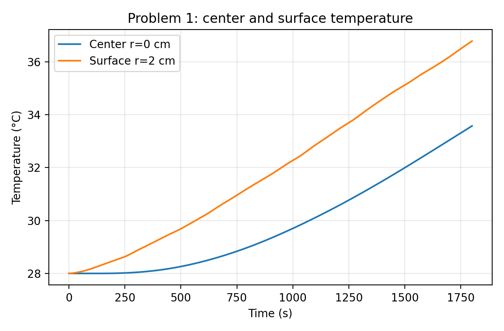

*图 1-3 圆心与表面温度随时间变化；1800 s 时温差 3.2097 °C*


*图 1-4 圆心与表面水分浓度随时间变化；表面持续失水而圆心几乎不变*

1800 s 时表面与圆心的温差为 3.2097 °C，圆心与表面的含水率差为 1.0397 kg/kg。两个场呈现相同方向但速率不同的结构：温度梯度在 30 min 内已充分建立，而含水率梯度几乎完全集中在表层，圆心含水率相对初始值仅变化 7.89×10⁻⁶ kg/kg。因此，预热阶段的实际作用是表面升温与初始排湿；圆心在 30 min 内基本保持初始状态，仅凭预热阶段无法判断药材何时整体达标，问题二必须进入恒温阶段，考察物性随状态变化后的水分迁移。

## 4. 问题二：恒温阶段 3 h 内的全过程

### 4.1 问题分析

问题一验证了求解框架，问题二把观察窗口扩展到 3 h，并把常数物性替换为附录 3 的经验式。本问的关键判断是：**物性的状态依赖是否足以影响结论**。若变化很小，沿用常数物性即可；若变化显著，就必须引入变物性。

计算显示 3 h 内物性确有明显变化：密度由 976.40 降到 778.99 kg/m³（1.25 倍），比热容由 3415.30 降到 2823.29 J/(kg·K)（1.21 倍），导热系数由 0.4830 降到 0.4007 W/(m·K)（1.21 倍），扩散系数的变化达 2.25 倍。因此本问必须采用变物性。

### 4.2 模型建立

控制方程与初始、边界条件与问题一相同（第 2 节），内部物性改为附录 3：

| 物性   | 表达式                                           | 单位       |
| ---- | --------------------------------------------- | -------- |
| 密度   | ρ = 650 + 128C                                | kg/m³    |
| 比热容  | c\_p = 1450 + 2736C/(C+1)                     | J/(kg·K) |
| 导热系数 | k = 0.21 + 0.38C/(C+1)                        | W/(m·K)  |
| 扩散系数 | D = 2.4×10⁻³·exp(−0.45/C)·exp(−3850/T)（T 取 K） | m²/s     |

表面系数继续取附录 2 的 h 与 hm：附录 3 只重新定义了内部物性，未给出新的边界系数，沿用是最小假设。按题目要求，问题二、三从 t = 0 起统一采用附录 3，不在 30 min 处切换物性。

### 4.3 模型求解

离散方法与问题一相同，空间步长 0.0625 mm、时间步 1 s，计算区间 0～10800 s。变物性使热量校验的口径需要调整：若沿用问题一的收支积分口径，会得到约 17.6% 的表观误差，这并非物理不守恒，而是该口径不适用于密度与比热容随状态变化的情形。因此问题二至四改用离散热方程残差校验热量，并明确不声称完整的热力学能量守恒。

在该设置下，水分守恒相对误差为 2.81×10⁻¹⁵，离散热方程残差为 3.62×10⁻¹⁴，Picard 迭代最多 3 次；网格与时间步加密引起的最大含水率变化分别为 1.89×10⁻⁵ 与 4.57×10⁻⁵ kg/kg。

### 4.4 结果与分析

**表 3 恒温阶段药材温度（°C）**

| 时间/h | r = 0 cm | r = 0.5 cm | r = 1 cm | r = 1.5 cm | r = 2 cm |
| ---: | -------: | ---------: | -------: | ---------: | -------: |
|  0.5 |  32.1907 |    32.3836 |  32.9673 |    33.9620 |  35.4139 |
|  1.0 |  40.3816 |    40.5536 |  41.0605 |    41.8783 |  42.9977 |
|  1.5 |  45.8461 |    45.9342 |  46.1924 |    46.6045 |  47.1396 |
|  2.0 |  48.4497 |    48.4875 |  48.5980 |    48.7731 |  49.0030 |
|  2.5 |  49.4666 |    49.4789 |  49.5133 |    49.5652 |  49.6610 |
|  3.0 |  49.8494 |    49.8553 |  49.8745 |    49.9101 |  49.9664 |

**表 4 恒温阶段药材水分浓度（kg/kg）**

| 时间/h | r = 0 cm | r = 0.5 cm | r = 1 cm | r = 1.5 cm | r = 2 cm |
| ---: | -------: | ---------: | -------: | ---------: | -------: |
|  0.5 |   2.5499 |     2.5489 |   2.5255 |     2.3257 |   1.6487 |
|  1.0 |   2.5257 |     2.4947 |   2.3578 |     2.0230 |   1.4711 |
|  1.5 |   2.3860 |     2.3256 |   2.1344 |     1.8020 |   1.3476 |
|  2.0 |   2.1708 |     2.1084 |   1.9236 |     1.6260 |   1.2311 |
|  2.5 |   1.9567 |     1.9006 |   1.7360 |     1.4720 |   1.1167 |
|  3.0 |   1.7662 |     1.7166 |   1.5702 |     1.3333 |   1.0081 |

表 3、表 4 给出 0.5～3 h 六个时刻的径向分布：与问题一相比，温度曲线之间的间距迅速收窄，而含水率曲线之间的间距在表面附近仍明显，说明两个场的推进速度不同；对应的径向剖面与汇总图见附录 D（图 2-1、图 2-2、图 2-5）。图 2-3 与图 2-4 把圆心与表面两条时间序列单独画出。

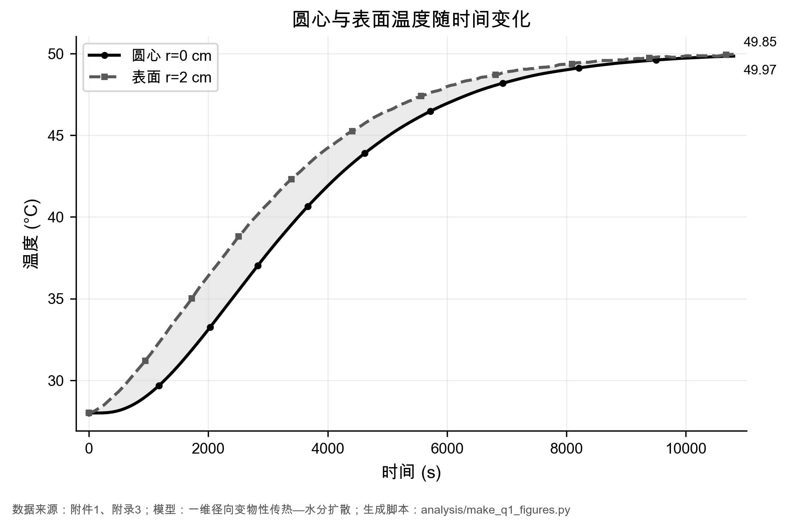

*图 2-3 圆心与表面温度随时间变化；两者的差距在 2 h 后基本消失*

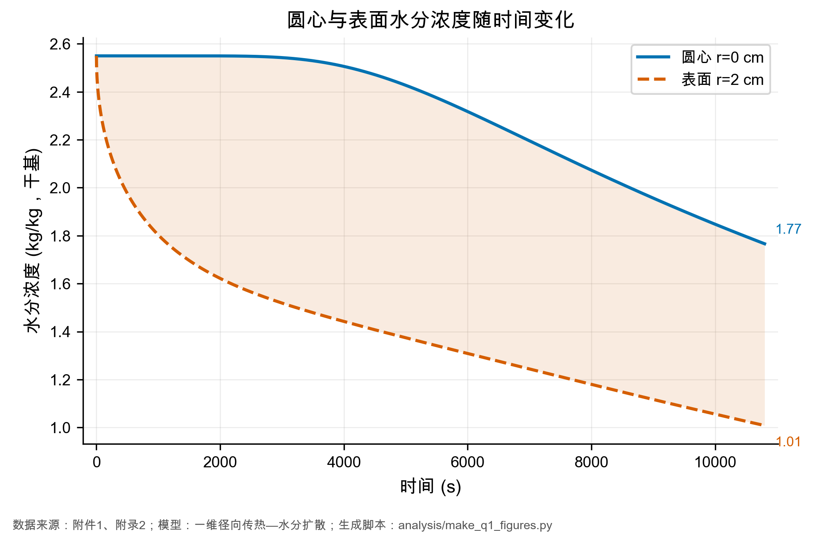

*图 2-4 圆心与表面水分浓度随时间变化；径向含水率差在 3 h 时仍有 0.7581 kg/kg*

3 h 时圆心与表面温差仅 0.1170 °C，说明传热阶段基本完成；而同一时刻圆心与表面的含水率差仍有 0.7581 kg/kg，圆心含水率 1.7662 kg/kg，远高于 0.15 kg/kg 的要求。传热与传质的时间尺度差异由此显现：热量通过导热快速抹平径向温差，水分却必须依靠扩散逐层迁移，且扩散系数随含水率下降急剧减小。这一差异决定了后续两问的形态——长期的慢速干燥阶段与由内部扩散控制的烘干瓶颈。但 3 h 的结果还不足以给出烘干时间，问题三必须把时间尺度扩展到整个干燥周期，并引入"各处达标"的终止判据。

## 5. 问题三：全周期与烘干终止判据

### 5.1 问题分析

问题三把计算区间从 3 h 扩展到 2～3 天，问题的性质也随之改变：不再是"给定时刻求状态"，而是"求达到工艺要求的时刻"。这里有两个必须先回答的问题：如何定义"各处达标"，以及在附件 1 数据只覆盖 4 h 的情况下，之后 2～3 天的边界条件如何确定。

第一个问题的答案是：水分由内向外扩散，表面最先达标、圆心最后达标，因此"各处达标"等价于圆心达标。第二个问题涉及数据边界，本文的处理见第 5.2 节。

### 5.2 模型建立

控制方程、物性与边界条件与问题二一致，本问新增两项内容。

**终止判据**：取

$t_f=\min\{t:\ \max_{\xi} C(\xi,t)\le 0.15\ \mathrm{kg/kg}\}$

并在数值结果中逐时刻验证圆心确实是空间最大含水率位置、且圆心含水率随时间单调下降。若改用平均含水率或表面含水率作判据，会显著低估烘干时间。

**长期边界处理**：附件 1 只覆盖到 14400 s，而本问需要推进到 2～3 天。本文采用末值保持，其依据来自附件 1 自身：空气温度在约 2 h 后已进入平台，在 49.8～50.2 °C 区间波动，含水率稳定在 0.050 kg/kg 附近，末值 50.165 °C 与 0.04986 kg/kg 正落在这个平台内。因此这是平台取值，而非趋势外推；该处理的影响在第 7.4 节量化为 +0.36 h。

### 5.3 模型求解

本问的计算规模比前三问大一个量级，因此数值设置是通过筛选确定的。空间步长最初沿用 0.0625 mm，但发现 r = 1.7～1.9 cm 的近表面干燥带在 24～58 h 相对更细网格的偏差达 2.25×10⁻³ kg/kg，超过 0.001 kg/kg 阈值；细化到 0.03125 mm 后该差降到 3.75×10⁻⁴ kg/kg。时间步方面，60 s 会在部分网格上触发非线性迭代不收敛，30 s 虽能收敛但在 0.5 h 的表面含水率相对 5 s 参考偏差 2.28×10⁻³ kg/kg，最终取 15 s（偏差 9.1×10⁻⁴ kg/kg）。

为排除实现层面的系统误差，另用一套节点中心差分配合自适应步长刚性积分器（BDF）的独立实现复核 0～24 h 的轨迹：圆心含水率最大差 7.5×10⁻⁴ kg/kg，圆心里程碑时刻相对差不超过 0.42%；该独立实现在网格减半后自身仅变化 2.3×10⁻⁶ kg/kg。

### 5.4 结果与分析

**表 5 全周期含水率（kg/kg，固定半径）**

|          时间/h | 0.0 cm | 0.5 cm | 1.0 cm | 1.5 cm | 2.0 cm |
| ------------: | -----: | -----: | -----: | -----: | -----: |
|             0 | 2.5500 | 2.5500 | 2.5500 | 2.5500 | 2.5500 |
|             6 | 1.0160 | 0.9872 | 0.9009 | 0.7549 | 0.5337 |
|            12 | 0.4550 | 0.4421 | 0.4021 | 0.3291 | 0.1641 |
|            18 | 0.2980 | 0.2907 | 0.2680 | 0.2248 | 0.0842 |
|            24 | 0.2372 | 0.2321 | 0.2162 | 0.1852 | 0.0662 |
|            30 | 0.2053 | 0.2014 | 0.1888 | 0.1638 | 0.0596 |
|            36 | 0.1855 | 0.1822 | 0.1715 | 0.1502 | 0.0565 |
|            42 | 0.1717 | 0.1688 | 0.1594 | 0.1406 | 0.0547 |
|            48 | 0.1615 | 0.1589 | 0.1505 | 0.1333 | 0.0536 |
|            54 | 0.1536 | 0.1512 | 0.1434 | 0.1276 | 0.0528 |
| 57.2667（达标时刻） | 0.1500 | 0.1477 | 0.1402 | 0.1250 | 0.0525 |

圆心含水率降到 0.15 kg/kg 的时刻为 **57.2667 h**；按达标时刻前后两点线性内插为 **57.2506 h**，两者相差不超过一个输出间隔（60 s）。本文以输出网格上的时刻为准报告结论，并给出内插值作为参考。

温度场的早期径向剖面（图 3-1）、圆心与表面温度（图 3-3）、四联汇总图（图 3-5）以及达标时间对网格与时间步的收敛诊断（图 3-6）见附录 D。

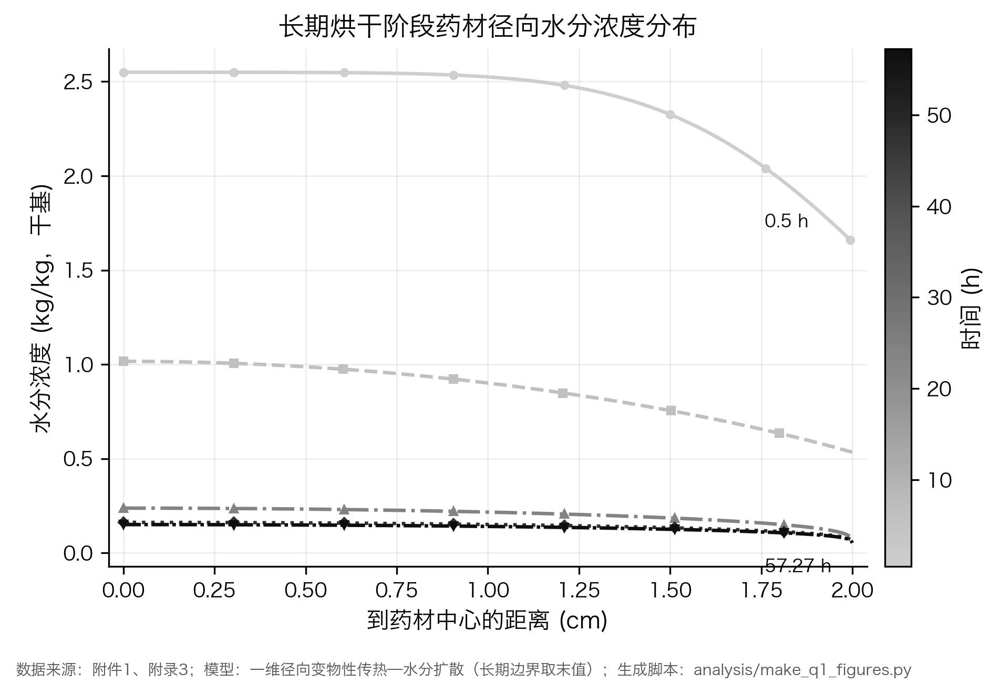

*图 3-2 长期烘干阶段药材径向水分浓度分布；24 h 之后剖面整体缓慢下移*


*图 3-4 圆心与表面水分浓度及 0.15 kg/kg 达标线；圆心曲线在 57.2667 h 穿越达标线*

圆心含水率的下降呈现三段结构：0～6 h 由 2.55 快速降到 1.016；6～24 h 降到 0.237；24 h 之后进入慢速尾部，直到 57.27 h 才降到 0.150。与此同时，表面含水率在 24 h 已降到 0.066，接近空气含水率，此后几乎不再变化。这说明烘干后期的绝大部分时间用于把最后一小部分水分从中心迁移到表面：此时表面已不是瓶颈，内部扩散系数才是。附录 3 的扩散系数按 exp(−0.45/C) 随含水率下降而急剧减小，正好对应这一慢化过程。

问题三的结果建立在一个前提上：计算期间药材半径保持 2 cm。但附件 2 显示药材在干燥过程中会明显收缩，这一前提在长时间尺度下并不成立，问题四因此引入随时间变化的半径与收缩态物性。

## 6. 问题四：考虑尺寸收缩的烘干时间

### 6.1 问题分析

附件 2 表明药材半径由 2.000 cm 单调减小到 1.198 cm，且收缩几乎全部发生在前期：1 h 时 1.794 cm，2 h 时 1.625 cm，12 h 时 1.248 cm，24 h 后稳定在约 1.20 cm。这意味着中后期的干燥实际上是在半径约 1.2 cm 的近似固定几何下进行的，收缩的作用主要集中在前十几个小时。

收缩会同时带来两个方向相反的影响：路程缩短有利于加快干燥，而附录 4 描述的收缩态组织扩散能力下降则不利于干燥。本问的核心就是把这两种效应分开量化，判断净效果。几何上还需要解决一个问题：外边界在动，计算域不能再用固定的 \[0, R]。

### 6.2 模型建立

**坐标变换**：引入材料坐标 ξ = r/R(t)。材料点固定在 ξ 上，计算域恒为 \[0,1]，几何收缩被转化为度量因子。仿射收缩（材料点半径按同一比例缩放）下的控制方程为

$\rho(C)c_p(C)\frac{\partial T}{\partial t}=\frac{1}{\xi R(t)^2}\frac{\partial}{\partial \xi}\left(\xi k(C)\frac{\partial T}{\partial \xi}\right)$

$\frac{\partial C}{\partial t}=\frac{1}{\xi R(t)^2}\frac{\partial}{\partial \xi}\left(\xi D(C,T)\frac{\partial C}{\partial \xi}\right)$

方程中不出现网格运动引起的对流项。干基含水率与温度都是材料量：C 表示每千克干物质所含的水量，材料点相对计算网格静止，扩散通量是相对材料的通量。若改用欧拉形式并保留 (ξ Ṙ/R)·∂C/∂ξ 项，会把收缩引起的体积压缩错误地记作水分富集。该形式还有一个实际好处：方程中只出现 R(t)，不需要对 1800 s 分辨率的实测半径求导，避免了数值微分放大噪声。

**边界条件**：物理梯度与材料坐标梯度相差因子 1/R(t)，因此表面条件写为

$-\frac{k}{R}\frac{\partial T}{\partial \xi}=h\left(T-T_{\mathrm{air}}\right),\qquad -\frac{D}{R}\frac{\partial C}{\partial \xi}=h_m\left(C-C_{\mathrm{air}}\right),\quad \xi=1$

**物性与半径**：内部物性改用附录 4 的 ρ = 760 + 90C、c\_p = 1850 + 2150C/(C+1)、k = 0.12 + 0.20C/(C+1)、D = 4.2×10⁻⁴·exp(−0.30/C)·exp(−3850/T)；表面系数仍取附录 2；半径序列直接使用附件 2 的分段线性插值，要求单调不增（出现回升即报错终止），t > 259200 s 时保持末值。

**输出口径**：由于半径会缩到约 1.2 cm，若按当前几何距离标注列，超过该半径的位置在后段将无定义。因此结果表以**材料点的初始距离**标注（0、0.1、…、1.9 cm），最后一列为"药材表面"，即当前移动边界。

### 6.3 模型求解

材料坐标下的离散只需对控制体体积乘 R\_rel²、对表面通量面积乘 R\_rel；界面通量项保持不变，因为物理步长 dr = R\_rel·dr\_ref 与界面面积同比例缩放。当 R\_rel ≡ 1 时，实现退化为固定半径求解器，这一点由回归测试逐数组校验（与问题一至三的求解器完全一致）。

数值设置沿用问题三的 0.03125 mm 与 15 s，使两问的差异完全归因于几何与物性。计算显示该设置在收缩域中收敛更好：生产网格相对 0.015625 mm 的达标时间差为 0.0058 h、含水率场最大差 5.26×10⁻⁵ kg/kg，时间步 15 s 相对 30 s 的达标时间差为 0.0099 h。原因是计算域随时间收缩，物理网格在中后期自动变细。

### 6.4 结果与分析

**表 6 全周期含水率（kg/kg，含收缩；列为材料点的初始距离）**

|          时间/h | 0.0 cm | 0.5 cm | 1.0 cm | 1.5 cm |   药材表面 |
| ------------: | -----: | -----: | -----: | -----: | -----: |
|             0 | 2.5500 | 2.5500 | 2.5500 | 2.5500 | 2.5500 |
|             6 | 1.7172 | 1.6308 | 1.3791 | 0.9810 | 0.4218 |
|            12 | 0.7346 | 0.7022 | 0.6066 | 0.4485 | 0.1667 |
|            18 | 0.4068 | 0.3921 | 0.3479 | 0.2706 | 0.0889 |
|            24 | 0.2838 | 0.2753 | 0.2489 | 0.2010 | 0.0671 |
|            30 | 0.2254 | 0.2194 | 0.2008 | 0.1661 | 0.0593 |
|            36 | 0.1921 | 0.1875 | 0.1730 | 0.1454 | 0.0558 |
|            42 | 0.1707 | 0.1668 | 0.1548 | 0.1317 | 0.0539 |
|            48 | 0.1557 | 0.1524 | 0.1420 | 0.1219 | 0.0529 |
| 50.8500（达标时刻） | 0.1500 | 0.1469 | 0.1372 | 0.1181 | 0.0525 |

收缩条件下的烘干时间为 **50.8500 h**（线性内插 50.8418 h），比固定半径的 57.2667 h 缩短 6.4167 h，约 11.2%。


*图 4-1 药材半径随烘干时间的收缩过程（附件 2 实测与分段线性插值）；24 h 后稳定在约 1.20 cm*

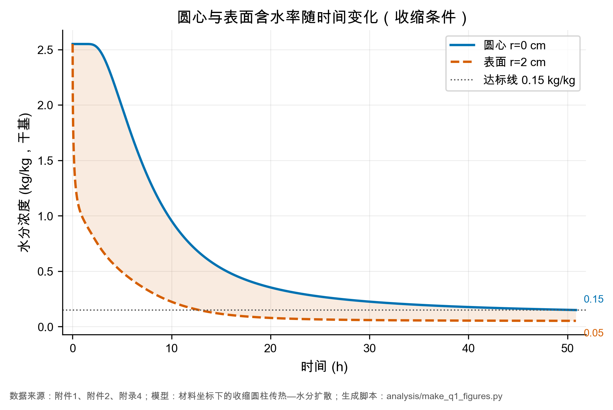

*图 4-3 收缩条件下圆心与表面水分浓度及 0.15 kg/kg 达标线；圆心在 50.8500 h 穿越达标线*


*图 4-6 固定半径与收缩条件下圆心水分浓度的对比；两条曲线在 40.96 h 交叉*

把表 6 与表 5 对照可以看出两种几何下的进程差异：在前 40 h 之前，收缩条件的圆心含水率一直略高于固定半径（半径尚未缩到位，而附录 4 的扩散系数已经变小）；两条曲线在 40.96 h 相交，此后收缩条件反超并持续领先，最终提前 6.4167 h 达标。图 4-6 直观呈现了这一交叉。水分浓度剖面（图 4-2）、圆心与表面温度（图 4-4）与四联汇总图（图 4-5）见附录 D。

从机制上看，收缩同时带来两个方向相反的影响。其一是路程缩短：半径由 2.000 cm 减到 1.198 cm，几何因子 (1.198/2.000)² ≈ 0.36，若其他条件不变，扩散特征时间应缩短到大约三分之一。其二是扩散能力下降：附录 4 的扩散系数前因子由 2.4×10⁻³ 降到 4.2×10⁻⁴、指数由 exp(−0.45/C) 改为 exp(−0.30/C)，在相同状态下比附录 3 小 2～5 倍（阈值附近约 2.1 倍）。两者相抵后路程缩短占优，收缩使烘干更快，但加快幅度只有 11.2%，远小于单纯按几何缩短预期的效果。

最后需要指出一处数据自身的不一致。附录 4 的密度公式隐含的干物质密度为 ρ\_dry(C) = (760 + 90C)/(1+C)：C = 2.55 时为 278.7 kg/m³，C = 0.15 时为 672.6 kg/m³，增大 2.41 倍；而附件 2 的半径收缩 2.000 → 1.198 cm 要求干物质密度增大 2.79 倍，两者相差约 13.5%。这说明题目给出的两组经验式并不完全自洽。本文按题目原样使用两式、不调整任何一方，因为任何"修正"都需要引入题目未授权的假设；该差异作为模型局限在第 7.5 节列出。

## 7. 模型检验与敏感性汇总

四问的结果分别在第 3.4、4.4、5.4、6.4 节给出，本节把它们共同依赖的可靠性证据集中列出。

### 7.1 守恒与离散一致性

| 问题 |   水分守恒相对误差 | 热量校验               |
| -- | ---------: | ------------------ |
| 一  | 7.23×10⁻¹⁵ | 收支积分 2.22×10⁻¹¹    |
| 二  | 2.81×10⁻¹⁵ | 离散热方程残差 3.62×10⁻¹⁴ |
| 三  | 1.54×10⁻¹⁴ | 离散热方程残差 3.93×10⁻¹³ |
| 四  | 5.34×10⁻¹⁵ | 离散热方程残差 2.24×10⁻¹³ |

问题二至四不使用收支积分口径校验热量，原因是变物性与移动边界下该口径会产生表观误差（问题二约 17.6%）；离散热方程残差直接刻画线性系统的闭合程度，不会把口径误差误读为物理不守恒。相应地，本文不声称完整的热力学能量守恒，只报告离散一致性。

### 7.2 网格与时间步收敛

| 问题 | 空间收敛（相对更细网格）                                                  | 时间步收敛                        |
| -- | ------------------------------------------------------------- | ---------------------------- |
| 一  | 0.125 mm 对 0.0625 mm：3.51×10⁻⁴ kg/kg                          | 1 s 对 0.5 s：2.04×10⁻⁴ kg/kg  |
| 二  | 0.125 mm 对 0.0625 mm：1.89×10⁻⁵ kg/kg                          | 1 s 对 0.5 s：4.57×10⁻⁵ kg/kg  |
| 三  | 0.03125 mm 对 0.015625 mm：Δt\_f = 0.0539 h，场差 3.754×10⁻⁴ kg/kg | 15 s 对 30 s：Δt\_f = 0.0131 h |
| 四  | 0.03125 mm 对 0.015625 mm：Δt\_f = 0.0058 h，场差 5.26×10⁻⁵ kg/kg  | 15 s 对 30 s：Δt\_f = 0.0099 h |

问题三的空间细化序列表现为单调收敛：达标时间随网格细化由 60.2289 h 依次降到 57.5779、57.2506、57.1967 h，相邻差由 2.65 h 收缩到 0.33 h 与 0.054 h，说明细化方向的偏差在快速衰减。完整的收敛数据保存在 `outputs/q3_convergence.json` 与 `outputs/q4_convergence.json`。

### 7.3 独立复算

为排除实现层面的系统误差，本文对两个关键问题另行实现了独立求解器，不共享生产求解器的空间离散、非线性处理与时间积分路径。问题一使用显式有限差分实现，与高分辨率隐式参考比较，验证了数值实现本身正确，同时发现粗网格下早期表面含水率尚未收敛，这直接促成了生产网格的细化。问题三使用节点中心差分（界面系数取算术平均）配合自适应步长刚性积分器（BDF），0～24 h 内圆心含水率最大差 7.5×10⁻⁴ kg/kg，里程碑时刻相对差不超过 0.42%，且该独立实现在网格减半后自身仅变化 2.3×10⁻⁶ kg/kg。

### 7.4 敏感性

| 敏感性对象         | 候选设置                         | 对结论的影响                        | 判定             |
| ------------- | ---------------------------- | ----------------------------- | -------------- |
| 长期空气边界（问题三、四） | 末值保持（基准）／后段均值保持／平台波动复现       | +0.36 h（57.25～57.61 h）        | 阈值 1 h 内，结论稳健  |
| 半径处理（问题四）     | 分段线性（基准）／三点平滑                | +0.0132 h                     | 可忽略            |
| 是否考虑收缩过程      | 收缩过程（基准）／直接按最终半径 1.198 cm 计算 | −3.2820 h                     | 超阈值，必须报告区间     |
| 含对流项的欧拉写法     | 只做量级比较                       | 附加项在 2 h 约为扩散项的 33%，24 h 约 1% | 未建完整替代模型，按量级说明 |
| 附件插值方式        | 分段线性（基准）／前值、后值保持、移动平均等       | 表面温度差 0.003～0.18 °C           | 已量化，见第 2.4 节   |

其中"直接按最终半径计算"一项说明：收缩与干燥是同步发生的，把药材先当作最终尺寸再计算会高估干燥速度，因此"何时收缩"与"最终缩到多大"同样重要。

### 7.5 已知偏差与不确定性

1. 长期边界处理：±0.36 h 量级；
2. 忽略蒸发潜热：方向明确（使计算偏快），幅度未量化，原因是题目未给出潜热相关参数；
3. 仿射收缩假设：内部变形不可观测，无法量化；
4. 附录 4 与附件 2 的干物质不自洽：约 13.5%（第 6.4 节）；
5. 附录 3、4 的扩散系数在低含水率端没有实测支持，属公式外推；
6. 没有药材内部温度与含水率的实测数据，因此本文提供的是解析极限、独立复算与自收敛证据，不能声称经验精度；
7. 未计入端部效应、壁面接触热阻与烘房内的气流不均匀。

## 8. 建模取舍与结论边界

### 8.1 明确不做的建模选项及其收益

| 不做的选项              | 是否想到 | 不做的理由                                | 这样做的好处                     | 若强行做的后果                                 |
| ------------------ | ---- | ------------------------------------ | -------------------------- | --------------------------------------- |
| 蒸发潜热与焓输运           | 想到   | 题目未给出汽化潜热、参考焓等参数                     | 模型参数全部可溯源，结论不依赖未标定常数       | 需引入题外参数，干燥速率被该参数主导，结论无法复核               |
| 非均匀收缩 / 干壳模型       | 想到   | 只测得外表轮廓 R(t)，内部变形不可识别                | 不把不可观测机制写入模型               | 需假设内部收缩分布，结论对该假设高度敏感且无法验证               |
| 二维 / 三维模型与端部效应     | 想到   | L/R = 12.5，端部面积占比很小                  | 参数需求与计算量大幅降低，同时保留主要梯度方向    | 计算量成倍增加，而所需的三维物性与边界数据题目并未提供             |
| 稳态或集总模型            | 想到   | Fo ≈ 0.76、Bi ≈ 1.39，温度场远未稳态且内外温差不可忽略 | 保留"内部梯度"这一决定烘干时间的核心现象      | 会抹掉本题要求考察的内部不均匀性，问题三、四无法回答              |
| 对附件数据做平滑、插补或异常点删除  | 想到   | 附件 1、2 无缺失、无重复、无倒序；平滑会改变题目给定的驱动      | 边界驱动与半径序列完全可追溯，结论不依赖预处理选择  | 结论随预处理方式变化（第 2.4 节已量化 0.16～0.18 °C 的差异） |
| 用经验拟合或数据驱动模型替代机理模型 | 想到   | 没有内部实测数据可供训练与验证                      | 模型结构与参数都有物理含义，避免用同一批数据自证   | 无法给出内部任意位置的预测，也无法回答参数变化时的趋势             |
| 用外部文献参数补齐题目缺口      | 想到   | 题目已给出全部所需参数，缺的部分（潜热等）不属于题目要求的机制      | 全部结论可回溯到题目与附件              | 引入来源不同的参数，量纲与适用范围可能不匹配                  |
| 重新拟合表面系数 h、hm      | 想到   | 附录 3、4 未重新定义边界系数                     | 边界条件在四问之间保持同源，差异只来自内部物性与几何 | 拟合缺少独立观测，等于用结果反推参数                      |

这些选项的共同特点是：它们都会增加模型的可调自由度，却无法用题目提供的数据验证这些自由度是否正确。因此本文选择保留一个参数量最小、每个参数都有题目出处的模型，并把它能回答与不能回答的问题都写清楚。

### 8.2 已完成但未纳入正文的工作

研究过程中还产生了若干保证结论可追溯、但不属于正文论证的产物，它们保留在仓库中：

| 工作                                            | 位置                                                                             | 不纳入正文的理由                              |
| --------------------------------------------- | ------------------------------------------------------------------------------ | ------------------------------------- |
| 决策日志与缺口登记（每个选择、备选方案与放弃原因）                     | `docs/decision_log.md`、`docs/problem_*_decision_log.md`、`docs/gap_register.md` | 属于审计轨迹，正文只保留结论与理由                     |
| 失败的数值尝试（粗网格把达标时间算成 226.7 h、时间步 60 s 触发非线性不收敛） | 决策日志与收敛产物                                                                      | 其作用是促成正确的数值设置，已由第 5.3 节体现；写入正文会偏离论证主线 |
| 独立复算的实现细节                                     | 实验报告与实验分支                                                                      | 正文只报告结论差异，实现细节属于可复现性材料                |
| 实验分支与版本管理流程（隔离、复跑、备份、清理）                      | `docs/experiments/`、Git 历史                                                     | 属于研究管理方法，不改变模型结论                      |
| 交付自检脚本（模板一致性、格式、数字与结果文件对照）                    | `analysis/delivery_check.py`、`docs/delivery_checklist.md`                      | 属于交付质量控制，不进入正文                        |

### 8.3 结论成立的边界

本文结论在以下范围内成立：药材可视为均质各向同性圆柱；空气状态由附件 1（14400 s 内）与末值保持（之后）描述；物性由附录 2、3、4 给出；不计潜热与相变；问题四采用仿射收缩。超出该范围时，例如烘房长期存在显著降温、药材开裂或发生非均匀收缩、或需要考虑蒸发吸热，本文给出的烘干时间需要重新标定。

## 9. 结论

1. 四个问题的数值结论：预热 30 min 后圆心 33.5765 °C、2.5500 kg/kg，表面 36.7863 °C、1.5103 kg/kg；恒温 3 h 后圆心 49.8494 °C、1.7662 kg/kg，表面 49.9664 °C、1.0081 kg/kg；固定半径下全域达标时间 57.2667 h；含收缩时 50.8500 h，缩短 6.4167 h，约 11.2%。
2. 传热远快于传质：3 h 时径向温差只剩 0.1170 °C，而含水率径向差仍有 0.7581 kg/kg，烘干后期的瓶颈在内部扩散。
3. 干燥过程分三段：0～6 h 快速失水、6～24 h 明显减速、24 h 之后进入慢速尾部；表面在 24 h 已接近空气含水率。
4. 收缩是两种机制竞争的结果：路程缩短约 40% 的有利作用被扩散系数下降 2～5 倍的不利作用大幅抵消，最终仍使烘干加快，但幅度远小于纯几何预期；且"何时收缩"不可忽略——直接按最终尺寸计算会低估 3.2820 h。
5. 数据处理方面，"只校验、不改值"的策略使全部结论可回溯到原始附件；敏感性实验表明替代插值方式会造成 0.003～0.18 °C 的表面温度差异，说明这一策略本身也是需要报告的选择。
6. 适用条件与系统偏差已逐项量化：长期边界 ±0.36 h；潜热未计（偏快方向）；附录 4 与附件 2 存在约 13.5% 的干物质不自洽；低含水率扩散系数属公式外推。没有内部实测数据，因此本文报告的是模型内部一致性与自收敛精度，而非经验精度。

## 附录 A 符号与单位表

| 符号         | 含义               | 输入单位         | 内核单位    | 输出单位     |
| ---------- | ---------------- | ------------ | ------- | -------- |
| r          | 到药材中心的径向距离       | cm           | m       | cm       |
| R(t)、R₀    | 当前半径、初始半径        | cm           | m       | cm       |
| ξ、R\_rel   | 材料坐标、半径比 R(t)/R₀ | 无量纲          | 无量纲     | 无量纲      |
| T、C        | 温度、干基含水率         | °C、kg/kg     | K、kg/kg | °C、kg/kg |
| ρ、c\_p、k、D | 密度、比热容、导热系数、扩散系数 | 见附录 2/3/4    | 同左      | 同左       |
| h、hm       | 对流换热系数、对流传质系数    | W/(m²·K)、m/s | 同左      | 同左       |
| t\_f       | 各处含水率均达标的时刻      | h            | s       | h        |

逐问物性：问题一 ρ = 820、c\_p = 2600、k = 0.36、D = 7×10⁻⁹exp(−0.89/C)；问题二、三 ρ = 650 + 128C、c\_p = 1450 + 2736C/(C+1)、k = 0.21 + 0.38C/(C+1)、D = 2.4×10⁻³exp(−0.45/C)exp(−3850/T)；问题四 ρ = 760 + 90C、c\_p = 1850 + 2150C/(C+1)、k = 0.12 + 0.20C/(C+1)、D = 4.2×10⁻⁴exp(−0.30/C)exp(−3850/T)。含温度的指数项统一使用 K。

## 附录 B 交付表格的数据来源

| 表号      | 内容        | 数据来源                                       |
| ------- | --------- | ------------------------------------------ |
| 表 1、表 2 | 问题一温度、含水率 | `outputs/result1.xlsx`（两个工作表）              |
| 表 3、表 4 | 问题二温度、含水率 | `outputs/result2.xlsx`                     |
| 表 5     | 问题三含水率    | `outputs/result3.xlsx`（`Sheet1`）           |
| 表 6     | 问题四含水率    | `outputs/result4.xlsx`（`Sheet1`，末列 `药材表面`） |

全部交付文件保留四位小数，其时间与距离网格、表头与单位均与题目模板一致。

## 附录 C 复现命令与运行记录

```bash
# 四个问题的完整求解与结果导出
python analysis/solve.py --problem 1
python analysis/solve.py --problem 2
python analysis/solve.py --problem 3
python analysis/solve.py --problem 4

# 论文图件（按问输出 PNG/PDF/SVG）
python analysis/make_q1_figures.py --problem 1
python analysis/make_q1_figures.py --problem 2
python analysis/make_q1_figures.py --problem 3
python analysis/make_q1_figures.py --problem 4

# 长时程收敛复算（耗时约 1 小时，默认不进入测试套件）
python analysis/q3_convergence.py
python analysis/q4_convergence.py

# 交付自检与测试
python analysis/delivery_check.py
python -m pytest -q
```

每次正式运行都会写出 `outputs/run_manifest_q<n>.json`，记录输入文件、求解参数、网格、时间步、代码哈希、命令与环境版本；相同命令与相同环境可复现相同结果。

## 附录 D 补充图件

正文只保留每问承担论证任务的图件（图 1-3、图 1-4、图 2-3、图 2-4、图 3-2、图 3-4、图 4-1、图 4-3、图 4-6）；本附录收录其余 13 张图，用于提供细节与数值诊断。图号沿用按问编号，位置移动不改变图号。全部 22 张图均同时提供 PNG、PDF、SVG 三种格式，存放于 `outputs/figures/`，编号规则与图注见 `docs/paper_figures.md`。

### D.1 问题一

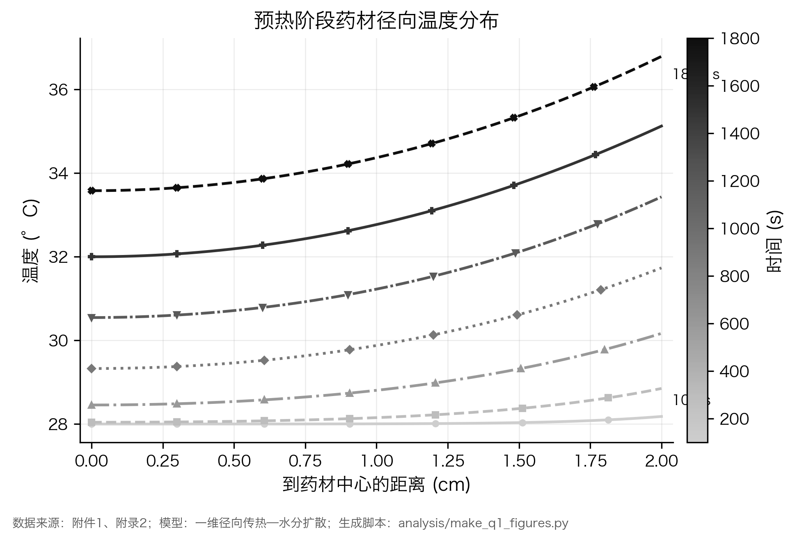

*图 1-1 预热阶段药材径向温度分布（100～1800 s，七个时刻）*

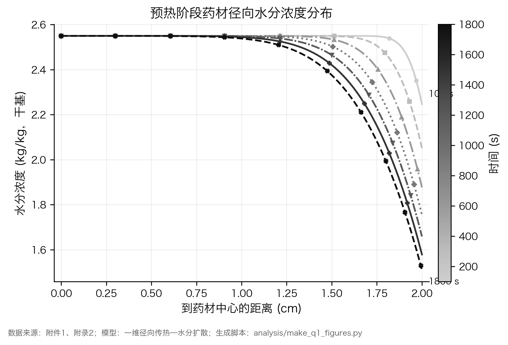

*图 1-2 预热阶段药材径向水分浓度分布；含水率梯度在前 30 min 内基本局限在表层 1 cm 以内*

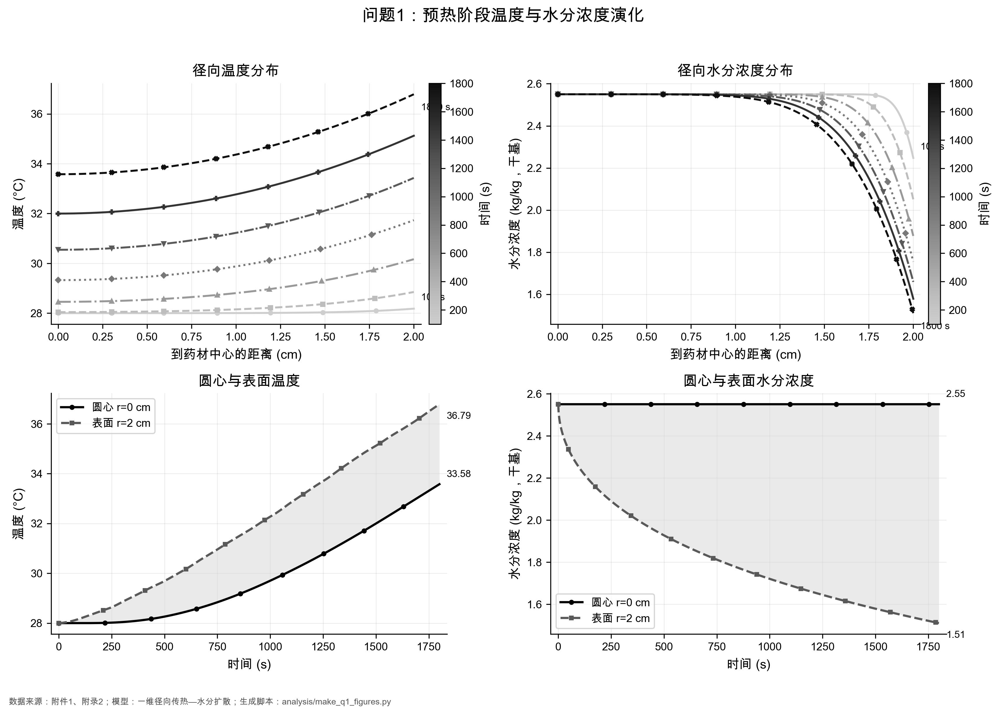

*图 1-5 问题一温度与含水率演化汇总（2×2）*

### D.2 问题二

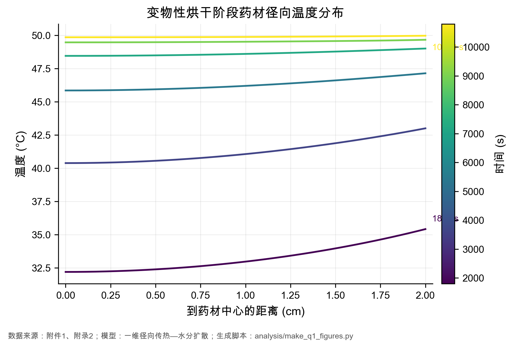

*图 2-1 恒温阶段药材径向温度分布（0.5～3 h）*

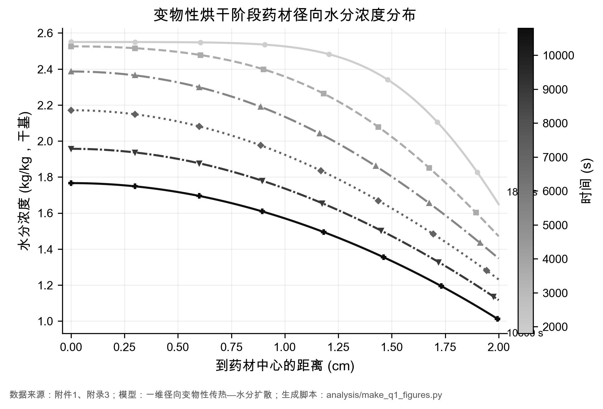

*图 2-2 恒温阶段药材径向水分浓度分布；3 h 时表面已降到 1.0081 kg/kg，圆心仍有 1.7662 kg/kg*

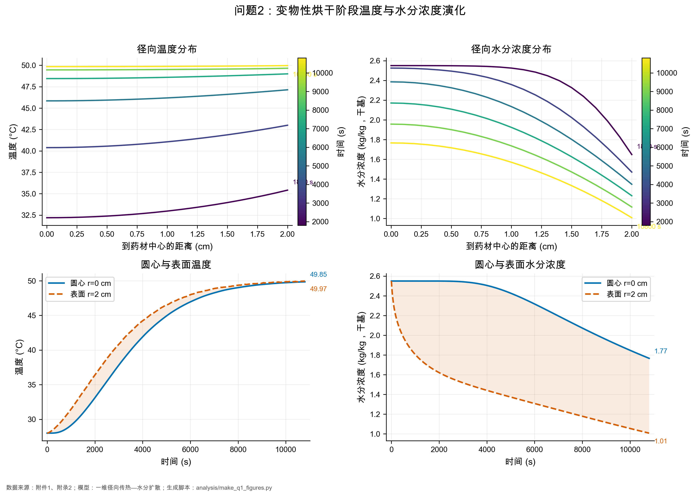

*图 2-5 问题二演化汇总（2×2）*

### D.3 问题三

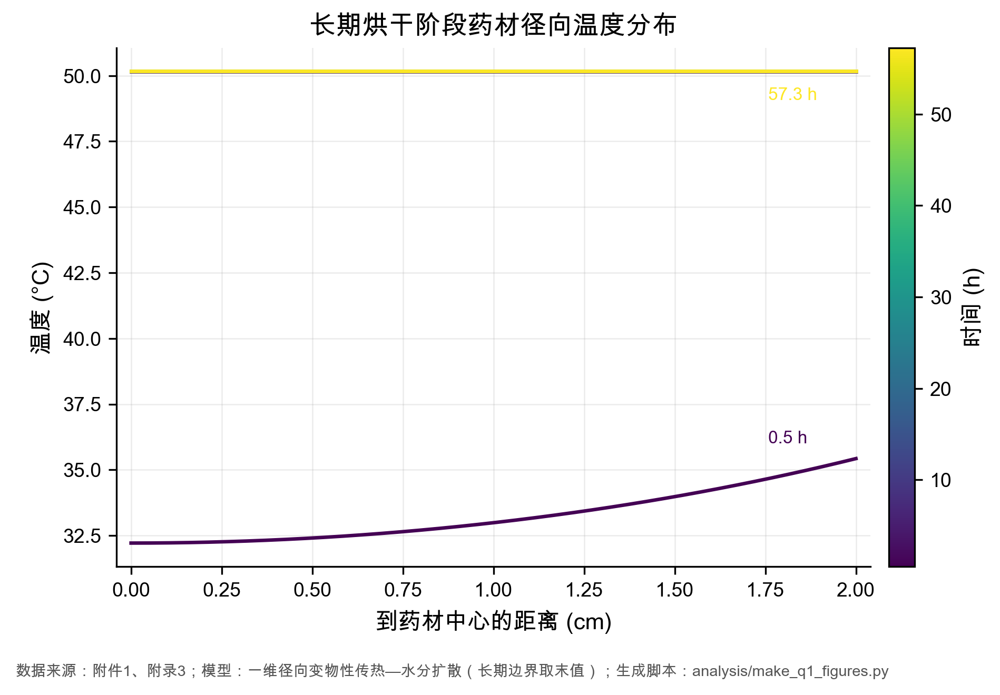

*图 3-1 长期烘干阶段前 6 h 的径向温度分布（0.25、0.6、1、2、6 h）；温度场在数小时内即趋于均匀*

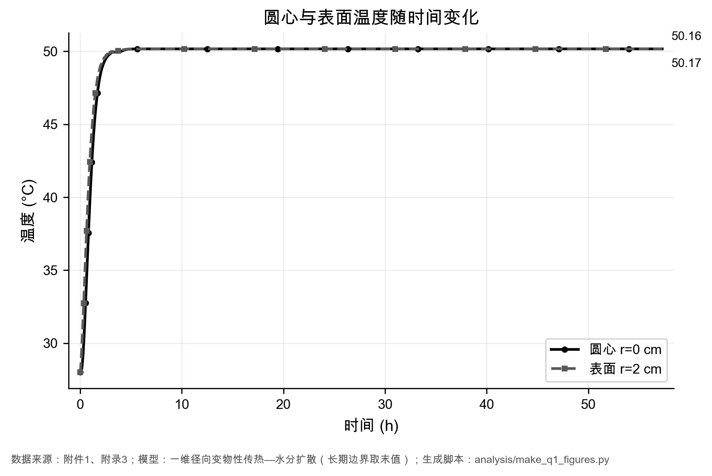

*图 3-3 圆心与表面温度随时间变化；中后期两者几乎重合*

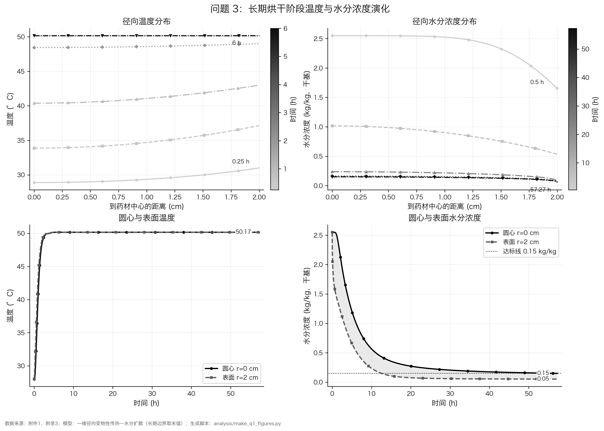

*图 3-5 问题三结果汇总（2×2）*

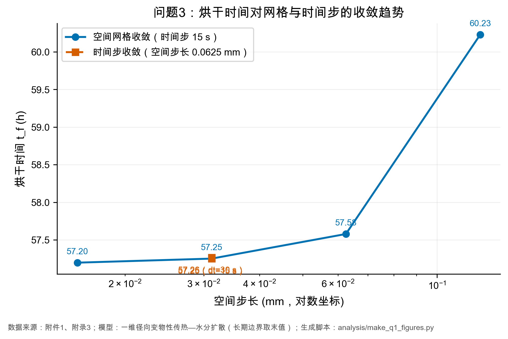

*图 3-6 达标时间对空间网格与时间步的收敛趋势；相邻网格差由 2.65 h 收缩到 0.054 h*

### D.4 问题四

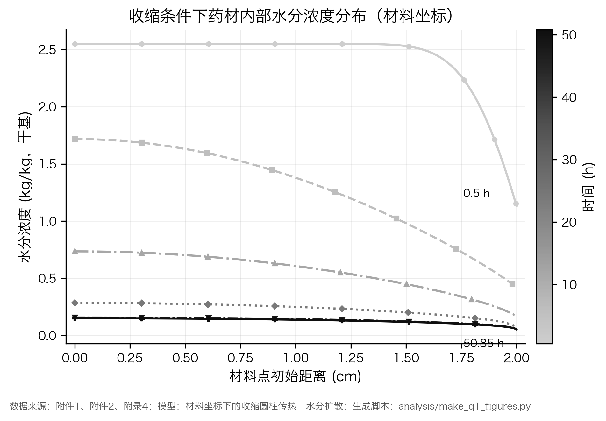

*图 4-2 收缩条件下药材内部水分浓度沿材料坐标的分布*

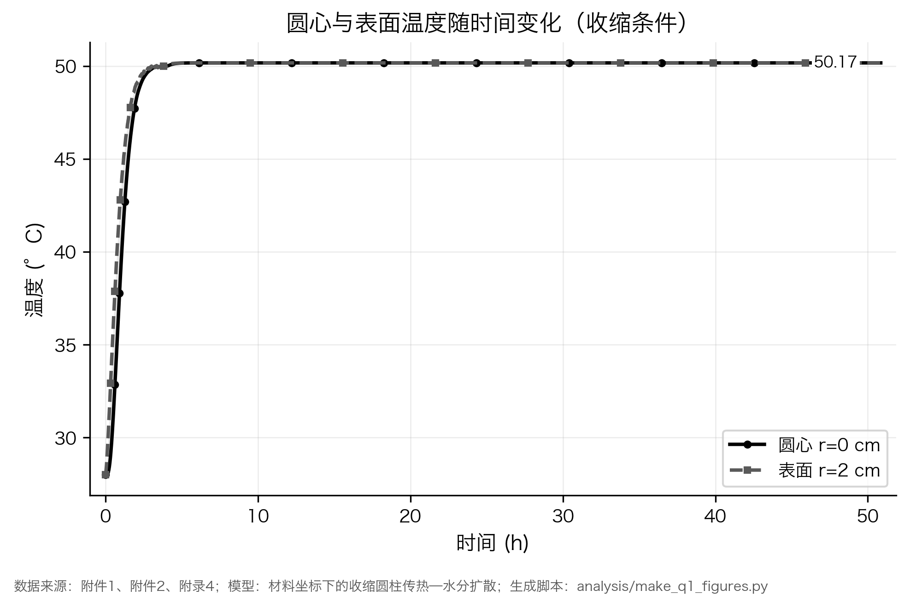

*图 4-4 收缩条件下圆心与表面温度变化；温度同样在数小时内趋于均匀*

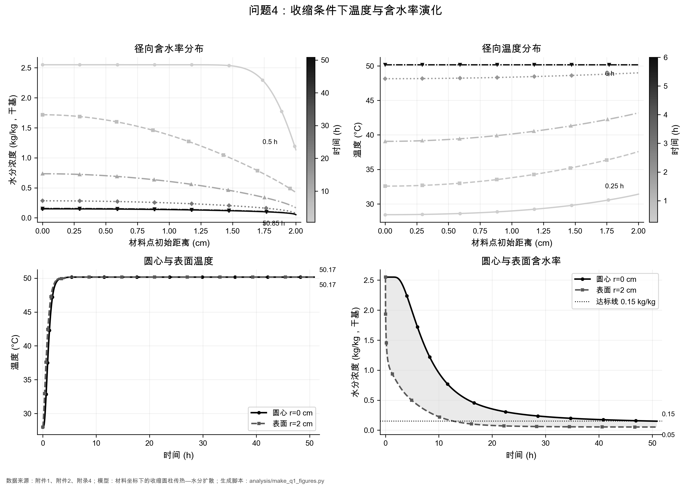

*图 4-5 问题四结果汇总（2×2，其中温度剖面为前 6 h）*

## 附录 E 数据与来源声明

本文使用的全部数据与参数来自：题目正文（几何尺寸、初始温度与初始含水率）、附件 1（烘房空气温度与含水率时序）、附件 2（药材半径时序）、附录 2（问题一物性与表面系数）、附录 3（问题二、三内部物性经验式）、附录 4（问题四收缩态物性经验式）以及交付模板（结果表的行列与单位要求）。本文未使用任何外部文献数据、外部实验数据或未经说明的估计参数；由于不涉及文献引用，本文不列参考文献。
